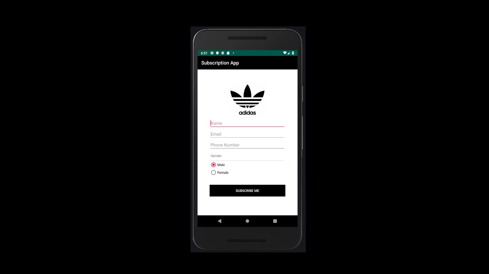
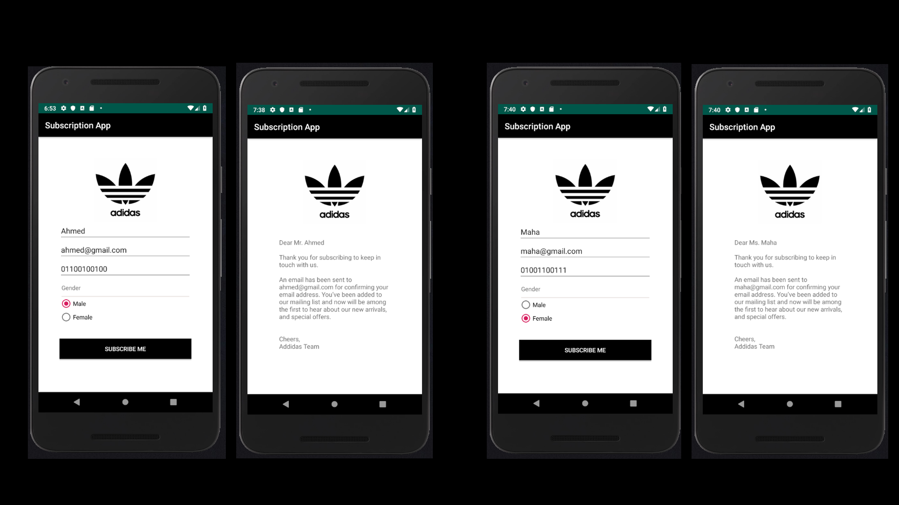

## Tutorial created: Project 2
# Subscription-App
#### Used API 29: Android 10 (Q)

## Screenshots

Focused on:
- Passing data via Explicit Intent
- Linear Layout
- Button
- Radio buttons & Radio Group

## License & Copyrights
Licensed under the [MIT License](LICENSE).
